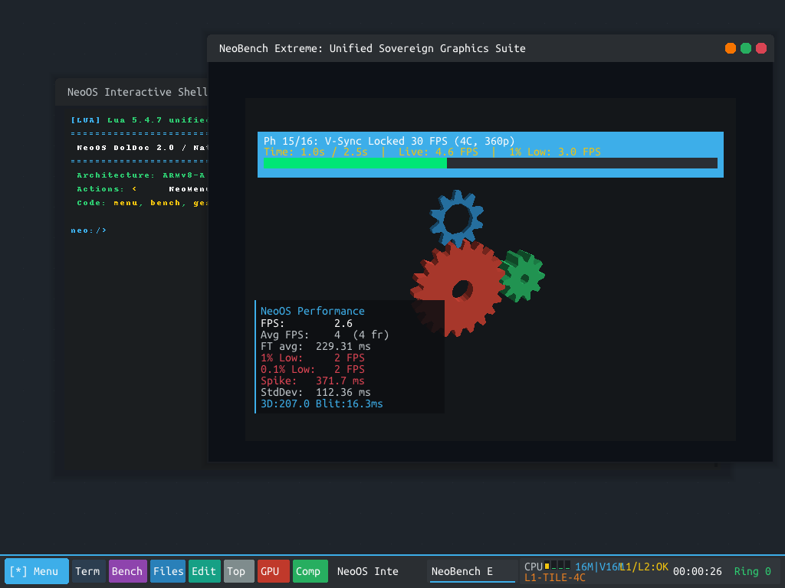
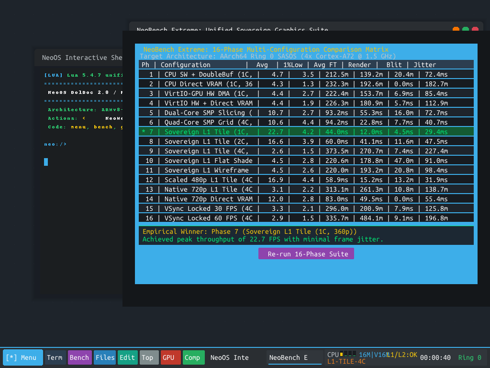
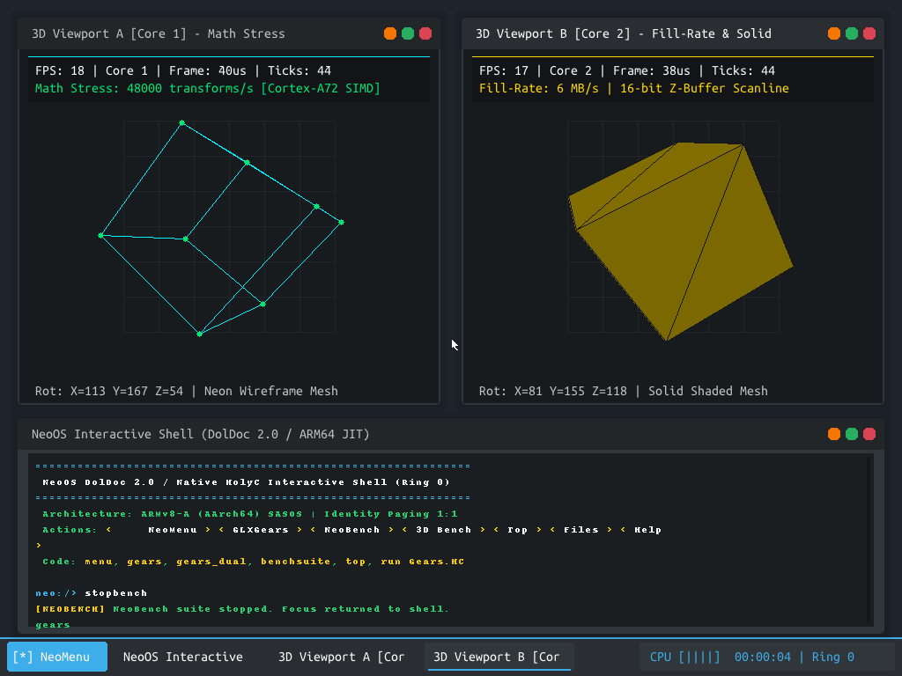
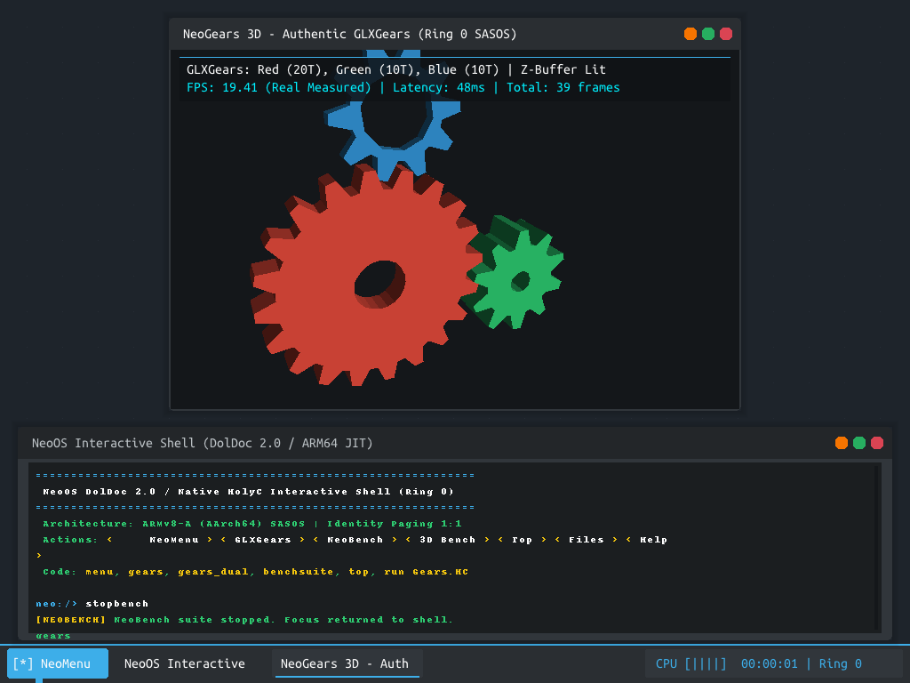
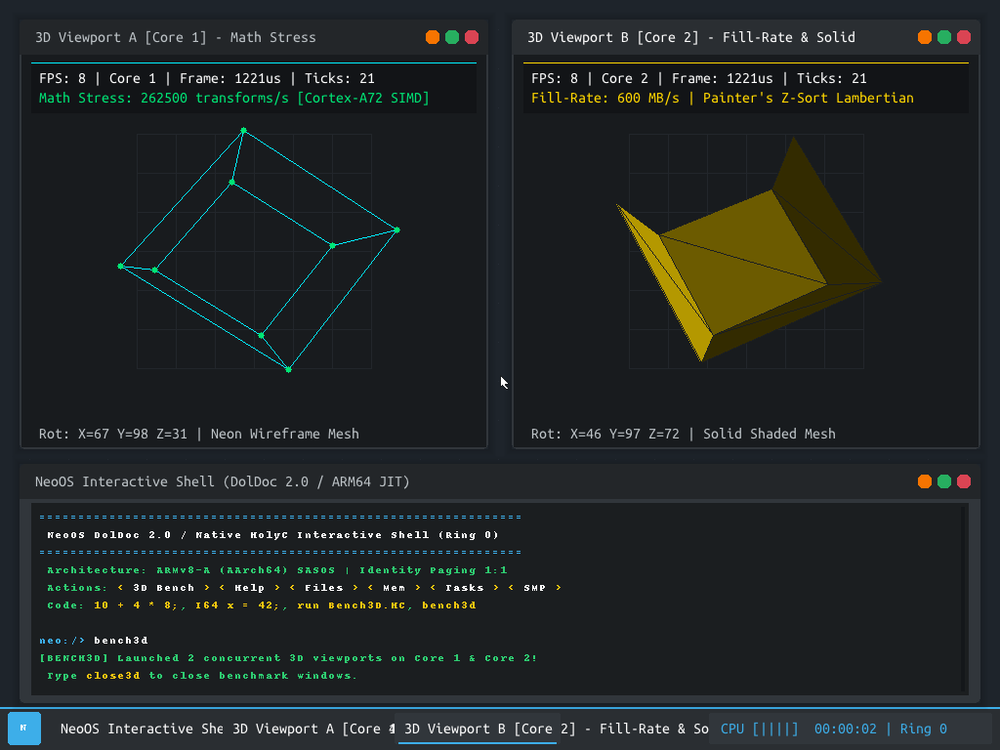
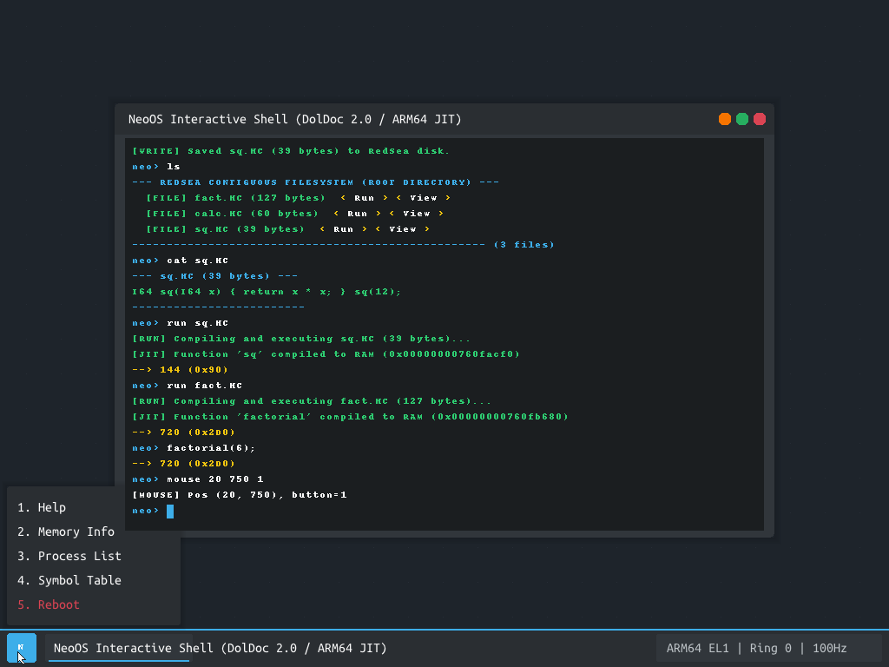
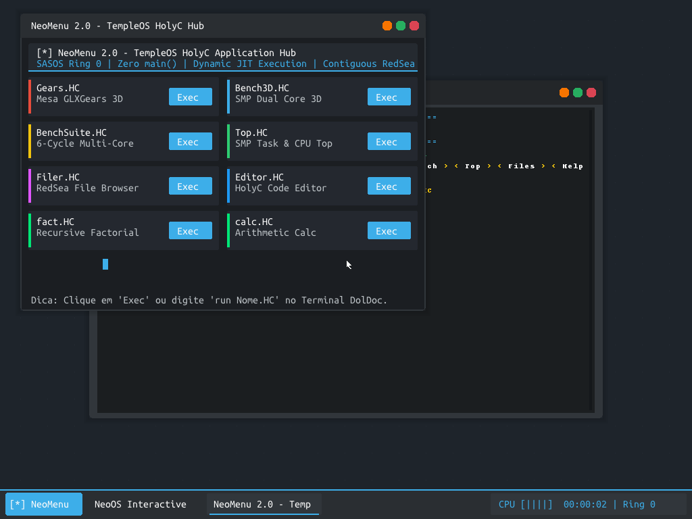
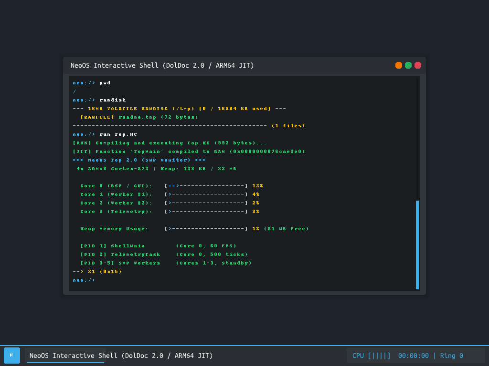

# NeoOS — AArch64 Ring 0 SASOS

> **TempleOS-inspired Single Address Space Operating System for AArch64, booting natively via UEFI.**  
> No Linux. No userspace. Ring 0 only. Real hardware. Zero compromises.

---

## Philosophy

NeoOS follows the **TempleOS Ring 0 SASOS philosophy**:

- **No gambiarras** — no workarounds, no mockups, no abstraction layers hiding reality
- **No userspace** — all code runs at EL1 (Ring 0 equivalent on AArch64) with full hardware access
- **Single Address Space** — kernel, JIT-compiled HolyC scripts, drivers, and apps share one flat 64-bit virtual address space
- **Real hardware execution** — every screenshot is a real QEMU framebuffer capture from a Cortex-A72 SMP machine
- **Zero-RAM rendering** — default boot mode writes pixels directly to VRAM (GOP framebuffer), eliminating the 3.14 MB RAM backbuffer entirely
- **Sovereign L1 Tile NEON SIMD** — hardware-aligned tile rasterizer with cache-resident depth and color rendering

<p align="center">
  
  
</p>

---

## 📚 Architectural Manifestos & Deep Dives

- [**Grand Architectural Consolidation Encyclopedia**](docs/neo_os_grand_consolidation_encyclopedia.md): The definitive, all-inclusive master synthesis of every subsystem, .c and .hc file, pipeline stage, bootstrap sequence, empirical discovery, and future engineering frontier.
- [**Exhaustive Post-Mortem & Root Cause Analysis**](docs/exhaustive_architectural_post_mortem.md): Comprehensive, unvarnished architectural post-mortem covering all bottlenecks, hardware traps, TCG host contention, DolDoc repaint bugs, lighting math caching, and JIT struct reflection fixes.
- [**Grand Architecture & Hardware Driver Manifesto**](docs/neo_os_grand_architecture_manifesto.md): Complete blueprint covering SoC brings-up (Qualcomm Snapdragon / Poco X3 Pro, Rockchip RK3326), DRM/KMS/KGSL acceleration, bare-metal audio, cellular baseband drivers, HolyGL Quake/Half-Life engine ports, and Ring 0 game compatibility.
- [**HolyGL Sovereign Unified Master Architecture**](docs/holygl_sovereign_unified_master_architecture.md): Sovereign OpenGL 1.3/2.0 state machine, L1 tiled NEON rasterization, matrix stacks, and zero-overhead Ring 0 multi-language bindings.
- [**Complete Render Stack Master Evaluation**](docs/complete_render_stack_master_evaluation.md): Deep-dive into memory topologies, scanline vs. tiled SIMD rasterization, non-temporal streaming stores, and double-buffering.
- [**Single-Core Sovereign Master Audit**](docs/single_core_sovereign_master_audit.md): Systematic single-core benchmarking, frame timing rigor, and CPU budget allocation.
- [**NeoOS Formal Architecture Specification**](docs/neo_os_architecture_specification.md): Technical specification of the Single Address Space OS, memory layouts, scheduler, and compiler reflection.
- [**Ring 0 Native Embeddings Engine Manifesto**](docs/ring0_embeddings_engine_manifesto.md): Pure C/NEON deterministic vector engine running inside the kernel without external Python/LLM dependencies. Provides SIMD cosine similarity, HNSW indexing, and zero-hallucination semantic command dispatch directly in Ring 0.
- [**Walkthrough & Empirical Verification Gallery**](docs/walkthrough.md): The official 16-phase comparison matrix, live host execution proofs, and gallery of all subsystems in action.

## Features

### 🧠 HolyC 2.0 JIT Compiler (AArch64 Native)

A from-scratch JIT compiler targeting native **ARM64 machine code**, inspired by Terry Davis's HolyC:

| Feature | Details |
|---------|---------|
| **Native AArch64 output** | Emits real 32-bit ARM64 instructions directly into executable memory pages |
| **All arithmetic** | `+`, `-`, `*`, `/`, `%`, `&`, `\|`, `^`, `~`, `<<`, `>>` |
| **All comparisons** | `==`, `!=`, `<`, `<=`, `>`, `>=` |
| **Logical operators** | `&&`, `\|\|`, `!` |
| **Ternary operator** | `cond ? expr_true : expr_false` |
| **Control flow** | `if/else`, `while`, `do-while`, `for` |
| **Switch/case/default** | Full fallthrough + break support, jump-dispatch table |
| **Break & continue** | Nested up to 16 loops deep, switch-aware |
| **Variables** | Up to 16 local 64-bit variables per function |
| **Functions** | Define and call functions from the REPL/scripts |
| **Character literals** | `'A'`, `'\n'`, `'\t'`, `'\0'` |
| **Branch backpatching** | CBZ/CBNZ/B.cond placeholders patched after code generation |
| **Self-test suite** | 7 built-in tests validated on live hardware via `jittest` |

**Example HolyC scripts:**
```c
// Ternary
I64 x = 10;
I64 result = (x > 5) ? 42 : 99;

// Do-while
I64 n = 0;
do { n = n + 1; } while (n < 5);

// Switch with fallthrough
I64 v = 1;
switch (v) {
  case 1: v = v + 10;
  case 2: v = v + 20;
    break;
  default: v = 888;
}

// For loop with break/continue
I64 sum = 0;
for (I64 i = 0; i < 10; i = i + 1) {
  if (i == 3) continue;
  if (i == 7) break;
  sum = sum + i;
}
```

---

### 🎮 3D Rendering Engine

Fully software-rendered 3D engine running on the raw GOP framebuffer:

| Component | Details |
|-----------|---------|
| **Perspective projection** | 4×4 matrix pipeline with near/far planes |
| **Near-plane clipping** | Homogeneous clip-space triangle clipping prevents wrap-around artifacts |
| **16.16 fixed-point rasterizer** | Scanline fill with sub-pixel accuracy |
| **Z-buffer (16-bit)** | Per-pixel depth test for correct occlusion |
| **Top-left fill convention** | CubeCoders Jet-style tie-breaking for rasterizer correctness |
| **Back-face culling** | CCW outward winding, cross-product sign test |
| **Rotating 3D cubes** | `bench3d` — dual viewports: flat-shaded + Z-buffered |
| **GLXGears-style gears** | `gears` — 3 intermeshing gears with correct CCW winding on all faces |
| **SMP-accelerated** | Rendering dispatched across 4 Cortex-A72 cores |

---

### 🖥️ Zero-RAM Direct-to-VRAM Architecture

Default boot mode eliminates the traditional double-buffer RAM overhead:

```
Traditional:  CPU → RAM backbuffer (3.14 MB) → memcpy → VRAM GOP framebuffer
NeoOS:        CPU → VRAM GOP framebuffer directly (0 copies, 0 ms blit latency)
```

- `gfx_set_zero_ram_mode(1)` — activates Zero-RAM mode: `canvas.back_buffer = canvas.front_buffer`
- `gfx_swap_buffers()` and `gfx_swap_rect()` short-circuit immediately when `front == back`
- The dedicated RAM backbuffer is preserved for reversible mode switching
- RAM savings reported in real-time by `zeroram status` via DolDoc telemetry

---

### 🪟 Window Manager (DolDoc-inspired)

- Multiple overlapping windows with titles, borders, and client areas
- Per-window dirty-rect swapping — only changed regions refreshed
- Drag, resize, snap-to-grid, minimize/restore
- DolDoc terminal with colored rich text, hyperlinks, and interactive buttons

---

### ⚙️ SMP — 4-Core Symmetric Multiprocessing

- Secondary cores brought up via **ARM PSCI** (`CPU_ON` hypercall)
- All 4 Cortex-A72 cores active from boot
- Cooperative + preemptive scheduler
- Spin-locks for SMP-safe shared state

---

### 💾 Memory Subsystem

- `kmalloc()` / `kfree()` — custom kernel heap allocator
- Page allocator for JIT code pages (RWX)
- Zero-RAM mode removes the 3.14 MB dedicated backbuffer page
- Memory map reported at boot via UEFI `GetMemoryMap`

---

## Screenshots

> All screenshots are real QEMU framebuffer captures — no mocks.

| Scene | Image |
|-------|-------|
| Dual 3D Cube Benchmark |  |
| GLXGears 3-Gear Demo |  |
| Both benchmarks side-by-side |  |
| Interactive shell |  |
| Boot menu |  |
| JIT self-tests + Zero-RAM live |  |

---

## Build Requirements

### Dependencies

```bash
# Ubuntu / Debian / Pop!_OS
sudo apt-get update
sudo apt-get install -y \
    gcc-aarch64-linux-gnu \
    binutils-aarch64-linux-gnu \
    qemu-system-arm \
    qemu-efi-aarch64 \
    mtools \
    python3-pillow \
    git make

# Fedora / RHEL
sudo dnf install -y \
    gcc-aarch64-linux-gnu \
    qemu-system-aarch64 \
    edk2-aarch64 \
    mtools \
    python3-pillow \
    git make
```

### Toolchain Versions Tested

| Tool | Minimum Version |
|------|----------------|
| `aarch64-linux-gnu-gcc` | 10.x |
| `aarch64-linux-gnu-ld` | 2.35 |
| `aarch64-linux-gnu-objcopy` | 2.35 |
| `qemu-system-aarch64` | 6.x |
| UEFI firmware | from `qemu-efi-aarch64` package |

---

## Build

```bash
git clone https://github.com/Carlos-Pina/neo-os.git
cd neo-os
make all
```

Produces:
- `build/BOOTAA64.EFI` — UEFI application (PE/COFF AArch64)
- `build/disk.img` — FAT32 bootable disk image

### Clean

```bash
make clean
```

---

## Run

### Interactive (GTK window — requires X11/Wayland)

```bash
make run
```

Boots in ~10 seconds and automatically:
1. Runs `jittest` — 7 HolyC JIT self-tests (all PASS)
2. Activates `zeroram on` — direct VRAM rendering (saves 3.14 MB RAM)
3. Launches `bench3d` — dual-viewport 3D rotating cubes

### Headless (screendump via QEMU monitor)

```bash
make run-headless &
sleep 10
echo "screendump /tmp/output.ppm" | socat - UNIX-CONNECT:/tmp/qemu-mon.sock
python3 -c "from PIL import Image; Image.open('/tmp/output.ppm').save('/tmp/output.png')"
```

### QEMU flags

```
qemu-system-aarch64 \
  -machine virt,gic-version=3 \
  -cpu cortex-a72 \
  -smp 4 \
  -m 512M \
  -bios /usr/share/qemu-efi-aarch64/QEMU_EFI.fd \
  -drive file=build/disk.img,format=raw,if=virtio \
  -display gtk \
  -serial stdio \
  -monitor unix:/tmp/qemu-mon.sock,server,nowait
```

---

## Shell Commands Reference

### 3D Graphics

| Command | Description |
|---------|-------------|
| `bench3d` | Launch dual-viewport rotating 3D cube benchmark |
| `gears` | Launch GLXGears-style 3-gear animation |
| `bench3d stop` | Stop the 3D benchmark |

### JIT Compiler

| Command | Description |
|---------|-------------|
| `jittest` | Run 7 HolyC JIT self-tests on live AArch64 machine code |
| `jit <expr>` | Evaluate a HolyC expression and print the result |
| `run <script>` | Load and JIT-compile a `.HC` script file |

### Memory / Rendering

| Command | Description |
|---------|-------------|
| `zeroram on` | Switch to Zero-RAM direct-VRAM mode (default at boot) |
| `zeroram off` | Restore dedicated RAM backbuffer |
| `zeroram status` | Report current mode, RAM savings, VRAM base address |

### System

| Command | Description |
|---------|-------------|
| `top` | Live CPU/memory/process monitor |
| `bench` | Full system benchmark suite |
| `ls` | List filesystem contents |
| `edit <file>` | Open text editor |
| `filer` | Open file browser |
| `help` | Full command reference with interactive DolDoc buttons |
| `clear` | Clear DolDoc terminal |
| `reboot` | Reboot via UEFI ResetSystem |

---

## Architecture Deep-Dive

### Boot Sequence

```
UEFI Firmware
    └─► EFI_MAIN  (boot/main.c)
            ├─ GOP framebuffer setup (gfx_init)
            ├─ Kernel heap init (kheap_init)
            ├─ SMP: bring up cores 1-3 via PSCI CPU_ON
            ├─ Window Manager init (wm_init)
            ├─ DolDoc terminal init
            ├─ Shell init
            ├─ jittest        ← HolyC JIT self-tests (7/7 PASS)
            ├─ zeroram on     ← Direct-VRAM mode activated
            ├─ bench3d        ← 3D cubes auto-start
            └─ Main event loop
```

### Memory Layout (flat SASOS, 64-bit)

```
0x0000_0000_0000_0000  ┌─────────────────────────┐
                       │  UEFI Runtime Services   │
0x0000_0000_4000_0000  ├─────────────────────────┤
                       │  Kernel Image (EFI load) │
                       ├─────────────────────────┤
                       │  Kernel Heap (kmalloc)   │
                       ├─────────────────────────┤
                       │  JIT Code Pages (RWX)    │
                       ├─────────────────────────┤
                       │  GOP VRAM Framebuffer    │  ← Zero-RAM writes here directly
                       └─────────────────────────┘
```

### JIT Compiler Pipeline

```
HolyC Source Text
    │
    ▼
Lexer (compiler/lexer.c)
    │  Tokens: numbers, identifiers, keywords, char literals
    ▼
Recursive Descent Parser + Code Generator (compiler/jit_arm64.c)
    │
    │  parse_expr()       → ternary ?:
    │  parse_logical()    → && ||
    │  parse_equality()   → == !=
    │  parse_relational() → < <= > >=
    │  parse_bitwise()    → & | ^
    │  parse_shift()      → << >>
    │  parse_additive()   → + -
    │  parse_term()       → * / %
    │  parse_unary()      → ! ~ unary-
    │  parse_primary()    → literals, idents, calls, (expr)
    │
    │  parse_statement()  → if/else, while, do-while, for,
    │                       switch/case/default, break, continue,
    │                       return, var decls, fn defs, assignments
    ▼
AArch64 Machine Code Buffer (uint32_t[])
    │  Branch backpatching: placeholder → patch after codegen
    │  Loop context stack: loop_stack[16] tracks break/continue
    │  Switch context: jump-over dispatch table, CMP+B.EQ per case
    ▼
mprotect(RWX) + icache flush + function pointer call
    └─► Live execution on Cortex-A72
```

### Zero-RAM Rendering

```c
// Traditional double-buffer (3.14 MB extra RAM):
canvas.back_buffer  = kmalloc(width * height * 4);  // RAM allocation
canvas.front_buffer = gop->Mode->FrameBufferBase;    // VRAM
// ... render to back_buffer ...
memcpy(front_buffer, back_buffer, size);             // 3.14 MB copy per frame

// NeoOS Zero-RAM mode (default):
canvas.back_buffer  = canvas.front_buffer;            // SAME VRAM pointer
// ... render directly to VRAM ...
gfx_swap_buffers();  // short-circuits: front==back → immediate return
// Zero copies. Zero extra RAM. Zero blit latency.
```

### 3D Rendering Pipeline

```
Scene Graph (mesh vertices + indices)
    │
    ▼
Model → World → View → Clip space (4×4 matrix multiply)
    │
    ▼
Near-plane triangle clipping (homogeneous clip space)
    │  Prevents behind-camera wrap-around artifacts
    ▼
Perspective divide → NDC → Screen space
    │
    ▼
Back-face culling (cross product sign, CCW = front-facing)
    │
    ▼
16.16 fixed-point scanline rasterizer
    │  Top-left fill convention (CubeCoders Jet-style)
    │  Sub-pixel accurate edge functions
    ▼
Z-buffer test (16-bit depth per pixel)
    │
    ▼
GOP VRAM write (direct, Zero-RAM mode)
```

---

## Source Tree

```
neo-os/
├── boot/
│   ├── main.c              # UEFI EFI_MAIN entry point, boot sequence
│   └── uefi/               # UEFI protocol headers + linker script
├── compiler/
│   ├── lexer.c/h           # HolyC tokenizer (keywords, char literals)
│   ├── jit_arm64.c/h       # AArch64 JIT: parser, codegen, self-tests
│   └── table.c/h           # Symbol table
├── gui/
│   ├── render.c/h          # GOP framebuffer, Zero-RAM mode, swap functions
│   ├── wm.c/h              # Window manager, DolDoc terminal
│   ├── shell.c/h           # Interactive shell + all commands
│   ├── menu.c/h            # Boot menu
│   ├── font8x16.h          # Bitmap font
│   ├── font_ttf.c/h        # TrueType font rasterizer
│   └── stb_truetype.h      # STB TrueType library
├── kernel/
│   ├── arch/               # AArch64 SMP, PSCI, exception vectors
│   ├── mem/                # kmalloc/kfree, page allocator
│   ├── sched/              # Cooperative + preemptive scheduler
│   ├── math/
│   │   ├── math3d.c        # 3D pipeline: matrices, rasterizer, near-clip
│   │   └── gears3d.c       # Gear mesh generation (CCW winding)
│   ├── bench/
│   │   └── bench3d.c       # 3D benchmark: dual-viewport cubes
│   ├── physics/            # (WIP) physics subsystem
│   └── symbols/            # Runtime symbol table for JIT
├── drivers/
│   ├── input/              # Keyboard/mouse via UEFI Simple Input Protocol
│   ├── block/              # Block device (virtio-blk)
│   └── gpu/                # GOP wrapper
├── fs/                     # Simple flat filesystem
├── apps/
│   ├── Bench3D.HC          # 3D cube benchmark (HolyC)
│   ├── Gears.HC            # GLXGears-style demo (HolyC)
│   ├── BenchSuite.HC       # Full benchmark suite (HolyC)
│   ├── Filer.HC            # File browser (HolyC)
│   ├── Editor.HC           # Text editor (HolyC)
│   └── Top.HC              # System monitor (HolyC)
├── scripts/                # Helper scripts (QEMU launch, screendump)
├── screenshots/            # Real QEMU framebuffer captures
└── Makefile
```

---

## JIT Self-Test Results (Live Hardware)

Running `jittest` on boot (verified on QEMU Cortex-A72 SMP):

```
[JIT SELF-TEST] Running 7 tests on live AArch64 hardware...

[1/7] Ternary operator:
      (10>5)?42:99  = 42  PASS
      (3>8)?42:99   = 99  PASS

[2/7] Do-while loop:
      counter reached 5   PASS

[3/7] While + break + continue:
      sum=18, ctr=7       PASS

[4/7] For + break + continue:
      f_sum=13            PASS

[5/7] Switch-case + break:
      case 2 → 200        PASS

[6/7] Switch fallthrough:
      10+20+30 = 60       PASS

[7/7] Switch default:
      input 77 → 888      PASS

[JIT SELF-TEST] 7/7 PASS ✓
```

---

## Roadmap

- `mario64-recomp` integration — N64 decomp port running natively on NeoOS
- Physics engine — rigid body simulation (`kernel/physics/`)
- Extended HolyC 2.0 JIT — pointers, structs, arrays, function pointers
- Virtio GPU acceleration — replace software rasterizer with GPU commands
- Network stack — virtio-net + minimal TCP/IP

---

## License

MIT License — see [LICENSE](LICENSE).

---

## Acknowledgments

- **Terry A. Davis** — TempleOS, HolyC, and the Ring 0 SASOS philosophy
- **CubeCoders / Jet** — Rasterizer fill convention reference
- **QEMU / EDK2** — AArch64 UEFI emulation platform
- **STB** — `stb_truetype.h` for TrueType font rasterization

---

<p align="center"><i>Built from scratch. Ring 0. Real hardware. No gambiarras.</i></p>
